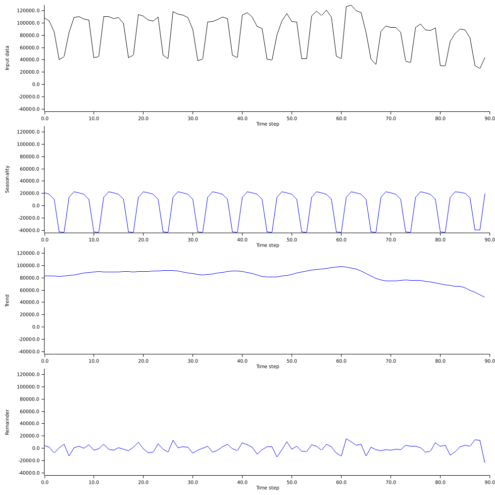

# stlplus-rs

[](https://crates.io/crates/stlplus-rs)
[](https://docs.rs/stlplus-rs)

[](https://deps.rs/repo/github/nmandery/stlplus-rs)

Port of the enhanced Seasonal Trend Decomposition using Loess (STL) implementation from
https://github.com/hafen/stlplus (and the java implementation https://github.com/ruananswer/twitter-anomalyDetection-java)
to rust.

At the current stage this project is mostly a rough port of the above repositories, there surely is room for improvement - PRs welcome.

## Example

See [crates_io_downloads.rs](examples/crates_io_downloads.rs).

```rust
cargo run --example crates_io_downloads
```




## License

<sup>
Licensed under either of <a href="LICENSE-APACHE">Apache License, Version
2.0</a> or <a href="LICENSE-MIT">MIT license</a> at your option.
</sup>
